# VisAPI Data Flow Diagram

## System Architecture Overview

This document provides a comprehensive data flow diagram for the VisAPI enterprise workflow automation system, including all external services, trust boundaries, and security zones.

## High-Level System Architecture


## Detailed Data Flow Analysis

### 1. User Authentication Flow


### 2. API Key Authentication Flow


### 3. Webhook Processing Flow


### 4. Queue Processing Flow

```mermaid
sequenceDiagram
    participant QUEUE as Redis Queue
    participant WORKER as BullMQ Worker
    participant SLACK as Slack API
    participant WHATSAPP as WhatsApp/CGB
    participant RESEND as Resend Email
    participant DB as Database
    participant STORAGE as Supabase Storage

    QUEUE->>WORKER: Job received
    WORKER->>DB: Load workflow definition
    DB-->>WORKER: Workflow steps

    loop For each step
        alt Slack notification
            WORKER->>SLACK: Send message
        else WhatsApp message
            WORKER->>WHATSAPP: Send via CGB API
        else Email notification
            WORKER->>RESEND: Send email
        else PDF generation
            WORKER->>WORKER: Generate PDF
            WORKER->>STORAGE: Store PDF
        end

        WORKER->>DB: Update step status
    end

    WORKER->>DB: Mark workflow complete
```



## Data Classification & Security Zones

### Data Classification

| Classification   | Examples                         | Security Requirements     |
| ---------------- | -------------------------------- | ------------------------- |
| **Public**       | API documentation, health checks | Standard HTTPS            |
| **Internal**     | System metrics, logs             | Authenticated access      |
| **Confidential** | User data, workflow configs      | Encrypted at rest/transit |
| **Restricted**   | API keys, secrets                | Hashed/encrypted storage  |

### Security Zones

#### 1. DMZ (Demilitarized Zone)

- **Components**: CDN, Load Balancers
- **Purpose**: Public-facing layer
- **Security**: DDoS protection, rate limiting

#### 2. Application Zone

- **Components**: Frontend, API Gateway, Workers
- **Purpose**: Business logic processing
- **Security**: Authentication, authorization, input validation

#### 3. Data Zone

- **Components**: Database, Redis, File Storage
- **Purpose**: Data persistence and caching
- **Security**: Encryption at rest, network isolation

#### 4. External Services Zone

- **Components**: Slack, WhatsApp, Resend, Grafana
- **Purpose**: Third-party integrations
- **Security**: API key management, rate limiting

## Trust Boundaries

### Boundary 1: Internet → CDN

- **Protection**: DDoS mitigation, geographic filtering
- **Validation**: Valid TLS certificates, HSTS headers

### Boundary 2: CDN → Application

- **Protection**: Origin validation, rate limiting
- **Validation**: Request signing, origin IP allowlist

### Boundary 3: Application → Data

- **Protection**: Connection pooling, query parameterization
- **Validation**: SQL injection prevention, input sanitization

### Boundary 4: Application → External Services

- **Protection**: API key rotation, request signing
- **Validation**: Response validation, timeout handling

## Network Security

### HTTPS/TLS Configuration

- **Minimum TLS**: 1.2 (preferred 1.3)
- **Cipher Suites**: Modern, secure ciphers only
- **HSTS**: Enabled with max-age=31536000
- **Certificate Pinning**: Implemented for critical services

### CORS Configuration

```javascript
{
  origin: ['https://app.visanet.app'],
  methods: ['GET', 'POST', 'PUT', 'DELETE'],
  allowedHeaders: ['Content-Type', 'Authorization', 'X-API-Key'],
  credentials: true
}
```

## Monitoring & Logging Data Flows

### Metrics Collection


### Log Aggregation


## Security Controls Summary

| Component     | Authentication    | Authorization      | Encryption | Monitoring         |
| ------------- | ----------------- | ------------------ | ---------- | ------------------ |
| Frontend      | Supabase Auth     | Role-based         | HTTPS/TLS  | Page views         |
| API Gateway   | API Keys          | Scoped permissions | HTTPS/TLS  | Request metrics    |
| Database      | Connection string | RLS policies       | At rest    | Query logs         |
| Redis         | AUTH token        | None               | In transit | Connection metrics |
| External APIs | API keys          | Service-specific   | HTTPS/TLS  | API call logs      |

## Data Retention & Privacy

### Data Retention Policies

- **Application logs**: 30 days
- **Workflow data**: 1 year
- **Metrics data**: 90 days
- **Audit logs**: 7 years

### PII Handling

- **Redaction**: Automatic PII redaction in logs
- **Encryption**: AES-256 for PII at rest
- **Access Control**: Role-based access to PII
- **Audit Trail**: All PII access logged

## Compliance Considerations

### GDPR Compliance

- **Data Subject Rights**: Export/delete capabilities
- **Consent Management**: Opt-in/opt-out mechanisms
- **Data Portability**: API endpoints for data export
- **Breach Notification**: Automated alerting systems

### SOC 2 Preparation

- **Access Controls**: Multi-factor authentication
- **Change Management**: Git-based deployments
- **Monitoring**: Comprehensive logging and metrics
- **Incident Response**: Automated alerting and procedures

---

**Last Updated**: July 16, 2025  
**Version**: 1.0  
**Author**: Security Team  
**Review Date**: August 16, 2025
