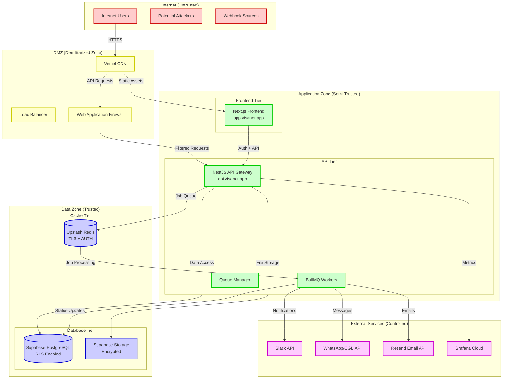
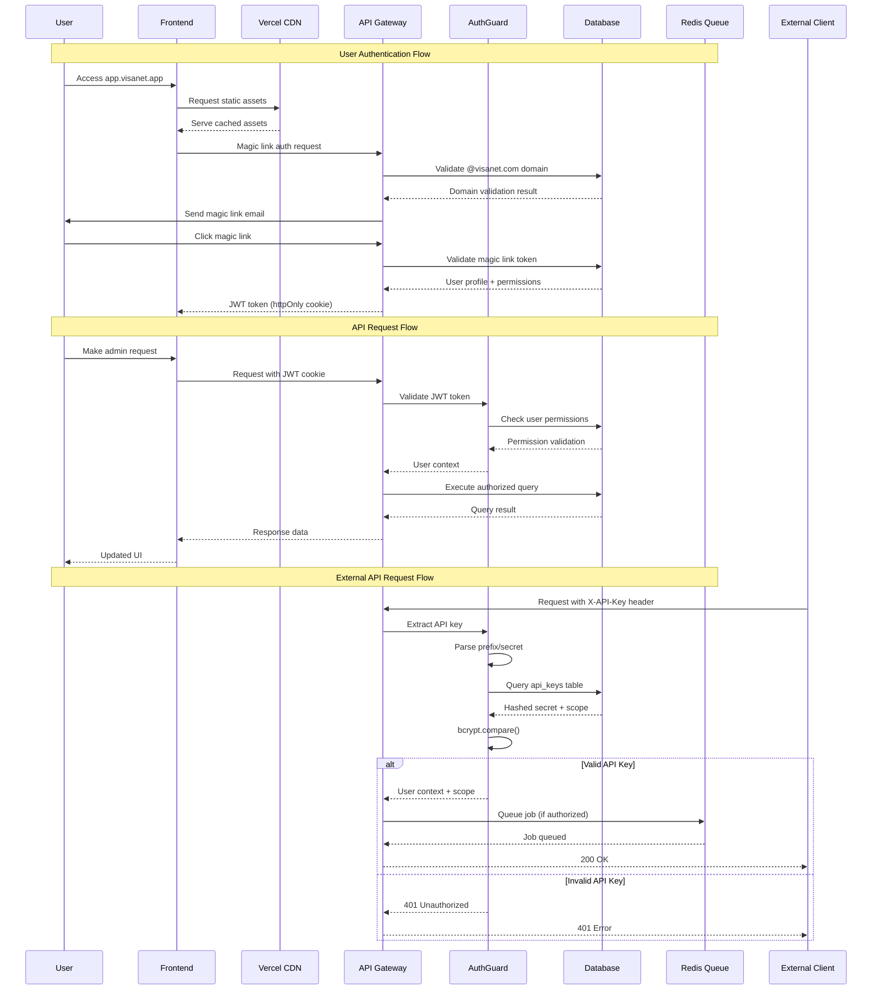
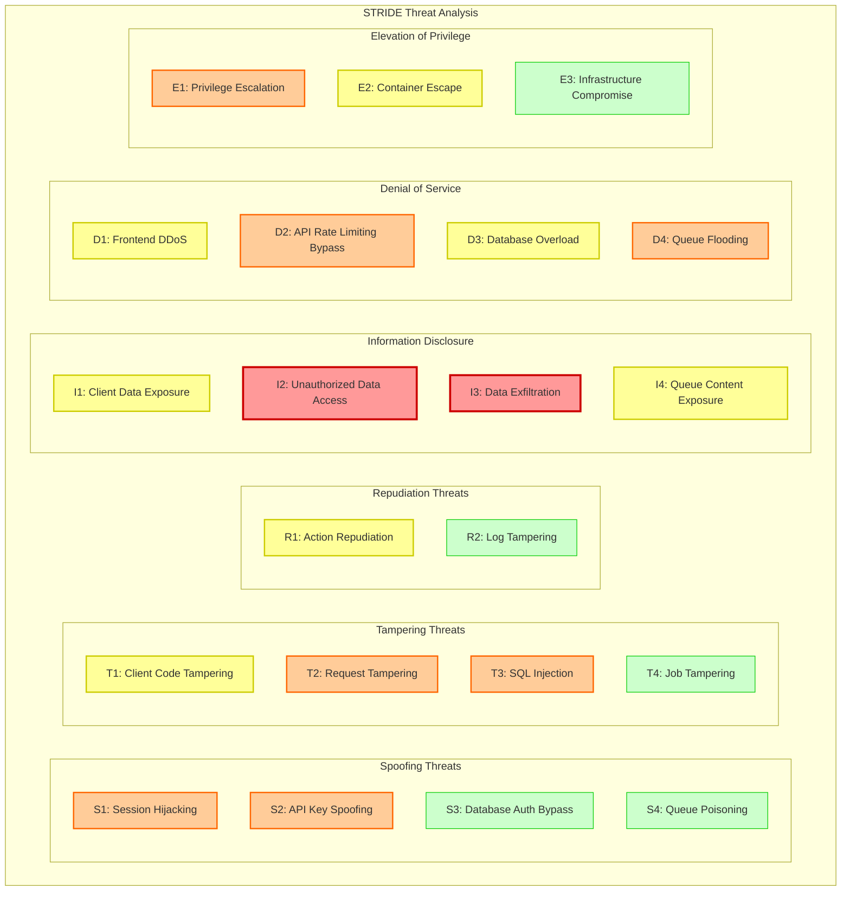
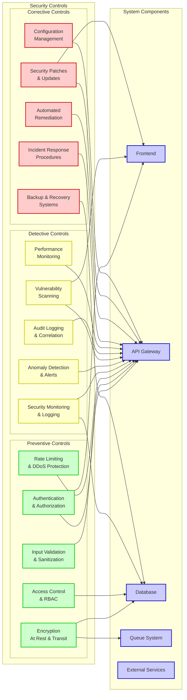
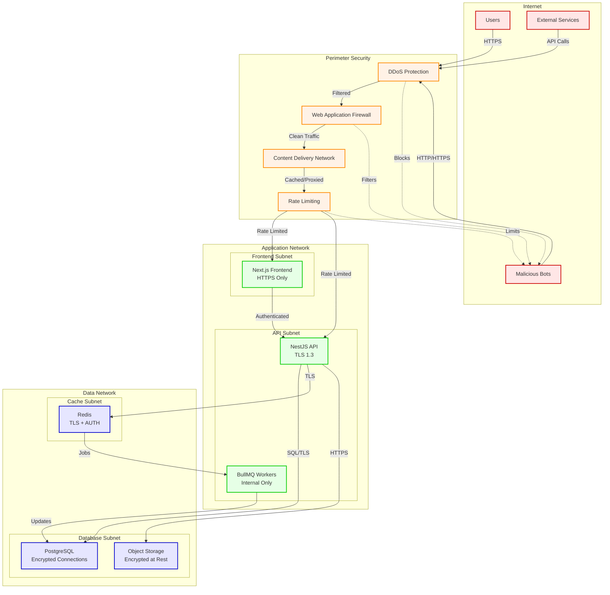
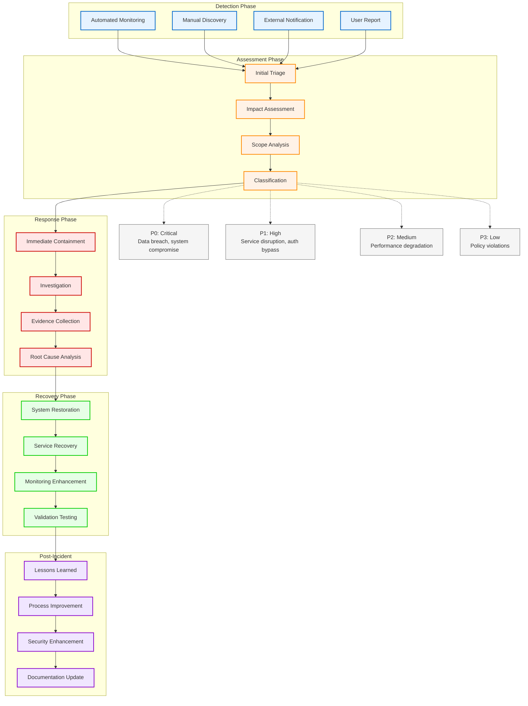
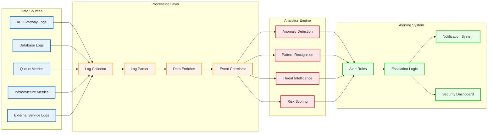

# VisAPI Security Architecture Diagrams

## Overview

This document contains comprehensive security architecture diagrams for the VisAPI system, including threat modeling visualizations, authentication flows, and security zone mappings.

## System Security Architecture

### Security Zones and Trust Boundaries

### Authentication and Authorization Flow

### Threat Model Visualization

### Security Controls Matrix

### Network Security Architecture

### Data Flow Security Analysis

```mermaid
graph TB
    subgraph "Data Classification"
        subgraph "Public Data"
            PUB1[API Documentation]
            PUB2[Health Endpoints]
            PUB3[Error Messages]
        end

        subgraph "Internal Data"
            INT1[System Metrics]
            INT2[Application Logs]
            INT3[Performance Data]
        end

        subgraph "Confidential Data"
            CONF1[User Profiles]
            CONF2[Workflow Configs]
            CONF3[Business Logic]
        end

        subgraph "Restricted Data"
            REST1[API Keys]
            REST2[Database Secrets]
            REST3[Encryption Keys]
        end
    end

    subgraph "Security Controls by Data Type"
        subgraph "Public Controls"
            PUBC1[Standard HTTPS]
            PUBC2[Basic Rate Limiting]
            PUBC3[CDN Caching]
        end

        subgraph "Internal Controls"
            INTC1[Authentication Required]
            INTC2[Access Logging]
            INTC3[Data Retention]
        end

        subgraph "Confidential Controls"
            CONFC1[Encryption in Transit]
            CONFC2[Encryption at Rest]
            CONFC3[Role-Based Access]
        end

        subgraph "Restricted Controls"
            RESTC1[Hashing/Salting]
            RESTC2[Key Management]
            RESTC3[Audit Logging]
        end
    end

    %% Data Flow Mappings
    PUB1 --> PUBC1
    PUB2 --> PUBC2
    PUB3 --> PUBC3

    INT1 --> INTC1
    INT2 --> INTC2
    INT3 --> INTC3

    CONF1 --> CONFC1
    CONF2 --> CONFC2
    CONF3 --> CONFC3

    REST1 --> RESTC1
    REST2 --> RESTC2
    REST3 --> RESTC3

    %% Styling
    classDef public fill:#e6ffe6,stroke:#00cc00,stroke-width:2px
    classDef internal fill:#ffffcc,stroke:#cccc00,stroke-width:2px
    classDef confidential fill:#ffcc99,stroke:#ff6600,stroke-width:2px
    classDef restricted fill:#ff9999,stroke:#cc0000,stroke-width:3px

    class PUB1,PUB2,PUB3,PUBC1,PUBC2,PUBC3 public
    class INT1,INT2,INT3,INTC1,INTC2,INTC3 internal
    class CONF1,CONF2,CONF3,CONFC1,CONFC2,CONFC3 confidential
    class REST1,REST2,REST3,RESTC1,RESTC2,RESTC3 restricted
```

### Security Incident Response Flow

### Supply Chain Security Analysis

```mermaid
graph TB
    subgraph "Development Environment"
        DEV1[Developer Workstation]
        DEV2[IDE & Tools]
        DEV3[Local Dependencies]
    end

    subgraph "Source Code Management"
        SCM1[GitHub Repository]
        SCM2[Branch Protection]
        SCM3[Code Reviews]
        SCM4[Signed Commits]
    end

    subgraph "Build Pipeline"
        BUILD1[GitHub Actions]
        BUILD2[Dependency Scanning]
        BUILD3[SAST Analysis]
        BUILD4[Container Building]
    end

    subgraph "Deployment Pipeline"
        DEPLOY1[Artifact Verification]
        DEPLOY2[Environment Config]
        DEPLOY3[Infrastructure Deploy]
        DEPLOY4[Health Checks]
    end

    subgraph "Production Environment"
        PROD1[Runtime Security]
        PROD2[Monitoring]
        PROD3[Incident Response]
        PROD4[Updates & Patches]
    end

    subgraph "External Dependencies"
        EXT1[npm Packages]
        EXT2[Docker Images]
        EXT3[Cloud Services]
        EXT4[Third-party APIs]
    end

    %% Security Controls
    DEV1 -.-> SEC1[Workstation Security]
    DEV2 -.-> SEC2[Tool Verification]
    DEV3 -.-> SEC3[Local Scanning]

    SCM1 -.-> SEC4[Repository Security]
    SCM2 -.-> SEC5[Access Control]
    SCM3 -.-> SEC6[Peer Review]
    SCM4 -.-> SEC7[Commit Signing]

    BUILD1 -.-> SEC8[Pipeline Security]
    BUILD2 -.-> SEC9[Vuln Scanning]
    BUILD3 -.-> SEC10[Static Analysis]
    BUILD4 -.-> SEC11[Container Security]

    DEPLOY1 -.-> SEC12[Artifact Integrity]
    DEPLOY2 -.-> SEC13[Config Security]
    DEPLOY3 -.-> SEC14[Infra Security]
    DEPLOY4 -.-> SEC15[Health Validation]

    EXT1 -.-> SEC16[Package Scanning]
    EXT2 -.-> SEC17[Image Security]
    EXT3 -.-> SEC18[Service Security]
    EXT4 -.-> SEC19[API Security]

    %% Flow Connections
    DEV1 --> SCM1
    SCM1 --> BUILD1
    BUILD1 --> DEPLOY1
    DEPLOY1 --> PROD1

    EXT1 --> DEV3
    EXT2 --> BUILD4
    EXT3 --> DEPLOY3
    EXT4 --> PROD1

    %% Styling
    classDef development fill:#e6f3ff,stroke:#0066cc,stroke-width:2px
    classDef scm fill:#f0e6ff,stroke:#8800cc,stroke-width:2px
    classDef build fill:#fff2e6,stroke:#ff8800,stroke-width:2px
    classDef deploy fill:#ffe6e6,stroke:#cc0000,stroke-width:2px
    classDef production fill:#e6ffe6,stroke:#00cc00,stroke-width:2px
    classDef external fill:#ffffe6,stroke:#cccc00,stroke-width:2px
    classDef security fill:#f5f5f5,stroke:#666666,stroke-width:1px,stroke-dasharray: 5 5

    class DEV1,DEV2,DEV3 development
    class SCM1,SCM2,SCM3,SCM4 scm
    class BUILD1,BUILD2,BUILD3,BUILD4 build
    class DEPLOY1,DEPLOY2,DEPLOY3,DEPLOY4 deploy
    class PROD1,PROD2,PROD3,PROD4 production
    class EXT1,EXT2,EXT3,EXT4 external
    class SEC1,SEC2,SEC3,SEC4,SEC5,SEC6,SEC7,SEC8,SEC9,SEC10,SEC11,SEC12,SEC13,SEC14,SEC15,SEC16,SEC17,SEC18,SEC19 security
```

## Security Metrics Dashboard

### Real-time Security Monitoring

---

**Last Updated**: July 16, 2025  
**Version**: 1.0  
**Author**: Security Team  
**Review Date**: August 16, 2025

**Usage Notes**:

- These diagrams are created using Mermaid syntax
- They can be rendered in GitHub, GitLab, or any Mermaid-compatible viewer
- Update diagrams when system architecture changes
- Use these diagrams during security reviews and threat modeling sessions
