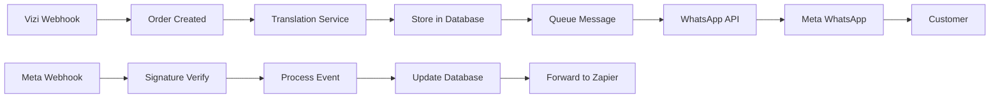

# WhatsApp Business API Integration Guide

## Overview

This guide documents the implementation of direct Meta WhatsApp Business API integration for VisAPI, providing enterprise-grade messaging capabilities with advanced features.

## Architecture

### Module Structure

```
libs/backend/whatsapp-business/
├── src/
│   ├── lib/
│   │   ├── services/
│   │   │   ├── whatsapp-api.service.ts      # Meta Graph API client
│   │   │   ├── webhook-verifier.service.ts  # HMAC-SHA256 verification
│   │   │   ├── template-manager.service.ts  # Template synchronization
│   │   │   ├── delivery-tracker.service.ts  # Message status tracking
│   │   │   └── message-queue.service.ts     # BullMQ processing
│   │   ├── types/
│   │   │   └── whatsapp.types.ts           # TypeScript interfaces
│   │   └── whatsapp-business.module.ts     # Module definition
```

### Integration Flow



## Implementation Status

### ✅ Completed (August 23, 2025)

1. **Module Structure**
   - NX library created at `libs/backend/whatsapp-business/`
   - All core services implemented
   - TypeScript types with 2025 API enhancements

2. **Core Services**
   - WhatsAppApiService: Direct Meta API communication
   - WebhookVerifierService: HMAC-SHA256 signature verification
   - TemplateManagerService: Template sync and quality monitoring
   - DeliveryTrackerService: Message and conversation tracking
   - MessageQueueService: Async message processing

3. **Database Schema**
   - Migration applied to Supabase
   - 6 new tables for WhatsApp data
   - Translation columns added to orders table

4. **Webhook Controller**
   - Verification endpoint for Meta setup
   - Event processing with signature validation
   - Zapier forwarding maintained

5. **Translation Optimization**
   - Hebrew translations for 40+ countries
   - Translations stored at order creation
   - Single translation per order (efficiency)

### 🚧 In Progress

- WhatsApp Message Processor (queue handler)
- Module registration in app.module.ts
- Parallel routing configuration

### 📝 Pending

- Meta App credentials configuration
- Template approval from Meta
- Integration testing
- Load testing
- Production deployment

## Configuration

### Environment Variables

```bash
# Meta WhatsApp Business API
WABA_PHONE_NUMBER_ID=your_phone_number_id
WABA_BUSINESS_ID=your_business_id
WABA_ACCESS_TOKEN=your_permanent_token
WABA_WEBHOOK_SECRET=your_webhook_secret_here
WABA_APP_SECRET=your_app_secret_here
WABA_WEBHOOK_VERIFY_TOKEN=your_verify_token_here
WABA_API_VERSION=v23.0
WABA_API_BASE_URL=https://graph.facebook.com

# Feature Flags
WHATSAPP_DASHBOARD_ENABLED=false  # Using CBB dashboard
WHATSAPP_ENABLE_FORWARDING=true   # Forward to Zapier
WHATSAPP_ENABLE_SLACK_ALERTS=true # Alert on failures
```

### Meta App Setup

1. **Create Meta App**
   - Go to https://developers.facebook.com
   - Create new app
   - Add WhatsApp product

2. **Configure Webhooks**
   - Callback URL: `https://api.visanet.app/api/v1/webhooks/whatsapp`
   - Verify token: Use value from `WABA_WEBHOOK_VERIFY_TOKEN`
   - Subscribe to fields:
     - messages
     - messages.status
     - message_template_status_update

3. **Generate Access Token**
   - Create permanent access token
   - Store in `WABA_ACCESS_TOKEN`

4. **Configure Webhook Secret**
   - Generate webhook secret
   - Store in `WABA_WEBHOOK_SECRET`

## API Usage

### Send Template Message

```typescript
const response = await whatsappApiService.sendTemplateMessage(
  '972507758758',
  'order_confirmation_global',
  'he',
  [
    { type: 'text', text: 'Customer Name' },
    { type: 'text', text: 'United Kingdom' },
    { type: 'text', text: '🇬🇧' },
    { type: 'text', text: 'ORD-123' },
    { type: 'text', text: 'Tourist Visa' },
    { type: 'text', text: '2' },
    { type: 'text', text: '99' },
    { type: 'text', text: '3-5 days' }
  ]
);
```

### Verify Webhook Signature

```typescript
const isValid = await webhookVerifierService.verifySignature(
  signature,
  rawBody
);

if (!isValid) {
  throw new UnauthorizedException('Invalid webhook signature');
}
```

### Track Message Delivery

```typescript
await deliveryTrackerService.trackMessage({
  messageId: 'wamid.xxx',
  phoneNumber: '972507758758',
  templateName: 'order_confirmation_global',
  status: 'sent',
  conversationId: 'conv_xxx',
  conversationCategory: 'MARKETING'
});
```

## Migration Strategy

### Phase 1: Foundation (✅ Complete)
- Module structure created
- Database schema deployed
- Core services implemented

### Phase 2: Integration (🚧 Current)
- Message processor implementation
- Module registration
- Parallel routing setup

### Phase 3: Testing
- Unit tests for all services
- Integration tests with Meta sandbox
- Load testing with 1000+ messages/min

### Phase 4: Gradual Rollout
- 10% traffic to WABA
- Monitor for 24 hours
- Increase to 50%
- Full migration after validation

### Phase 5: Optimization
- Template A/B testing
- Conversation pricing optimization
- Quality score improvement

## Security Features

### Webhook Signature Verification

```typescript
// HMAC-SHA256 verification required by Meta
const expectedSignature = crypto
  .createHmac('sha256', webhookSecret)
  .update(rawBody)
  .digest('hex');

const receivedSignature = signature.replace('sha256=', '');
return crypto.timingSafeEqual(
  Buffer.from(expectedSignature),
  Buffer.from(receivedSignature)
);
```

### Replay Attack Prevention

- Timestamp validation (5-minute window)
- Event ID tracking for deduplication
- Database persistence for audit

## Monitoring

### Metrics Tracked

- Message send success rate
- Template quality scores
- Conversation categories and costs
- Delivery status distribution
- Webhook processing latency

### Alerts Configured

- Failed message sends > 5%
- Template quality score < 0.5
- Webhook signature failures
- Rate limit approaching

## Troubleshooting

### Common Issues

1. **Webhook Verification Fails**
   - Check `WABA_WEBHOOK_VERIFY_TOKEN` matches Meta config
   - Ensure GET endpoint returns challenge parameter

2. **Signature Validation Fails**
   - Verify `WABA_WEBHOOK_SECRET` is correct
   - Ensure raw body is used (not parsed JSON)
   - Check for proper sha256= prefix removal

3. **Template Not Found**
   - Verify template is approved in Meta Business Manager
   - Check template name and language code
   - Ensure template is assigned to phone number

4. **Rate Limiting**
   - Implement exponential backoff
   - Check current rate limit headers
   - Consider message batching

## Testing

### Unit Tests

```bash
pnpm nx test whatsapp-business
```

### Integration Tests

```bash
# Test webhook verification
curl -X GET "http://localhost:3000/api/v1/webhooks/whatsapp?hub.mode=subscribe&hub.verify_token=test_token&hub.challenge=test_challenge"

# Test webhook event
curl -X POST "http://localhost:3000/api/v1/webhooks/whatsapp" \
  -H "Content-Type: application/json" \
  -H "X-Hub-Signature-256: sha256=xxx" \
  -d '{"entry":[...]}'
```

### Load Testing

```javascript
// k6 load test script
import http from 'k6/http';
import { check } from 'k6';

export let options = {
  stages: [
    { duration: '2m', target: 100 },
    { duration: '5m', target: 1000 },
    { duration: '2m', target: 0 },
  ],
};

export default function() {
  const res = http.post('http://localhost:3000/api/v1/whatsapp/send', {
    phoneNumber: '972507758758',
    templateName: 'order_confirmation_global',
    parameters: [...]
  });
  
  check(res, {
    'status is 200': (r) => r.status === 200,
    'message sent': (r) => JSON.parse(r.body).success === true,
  });
}
```

## References

- [Meta WhatsApp Business API Documentation](https://developers.facebook.com/docs/whatsapp)
- [Webhook Security Best Practices](https://developers.facebook.com/docs/whatsapp/cloud-api/webhooks)
- [Template Message Guidelines](https://developers.facebook.com/docs/whatsapp/message-templates)
- [Conversation-Based Pricing](https://developers.facebook.com/docs/whatsapp/pricing)

---

**Last Updated**: August 23, 2025  
**Status**: Implementation 53% Complete  
**Author**: VisAPI Development Team